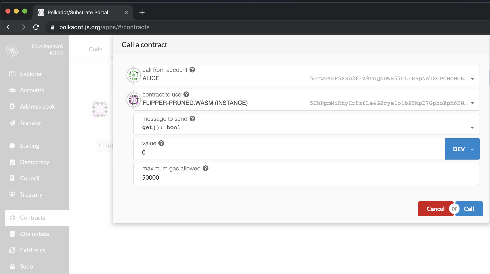

Calling Your Contract
===

Now that your contract has been fully deployed, we can start to interact with it! Flipper only has two functions, so we will show you what it's like to play with both of them.

## get()

If you take a look back at our contract's `deploy()` function, we set the initial value of the Flipper contract to `false`. Let's check that this is the case.

In the **Call** section, set the _message to send_ to `get(): bool`. Set the _maximum gas allowed_ to `500,000`.

> **Note:** You should not need to send any _value_ when making a contract call, but there is a temporary bug in the UI requiring it, so we just put `1`.



Contract calls cannot return a value to the outside world. So when you press **Call**, you will get a pretty unsatisfying `system.ExtrinsicSuccess` message. However, ink! provides a debugging tool to enable you to print messages to your node's terminal.

If we take a look, we can actually see our storage value:


> **Note:** `env.println` is only allowed on `--dev` chains for debugging purposes. If you try to deploy a contract with `env.println` on a non-dev chain, it will not succeed.

While this is not a great long term solution, it works very well for debugging contracts, and is a placeholder for more mature solutions like contract events and dedicated view RPCs which are still under development.

## flip()

So let's make the value turn `true` now!

The alternative _message to send_ we can make with the UI is `flip()`. Again, set the _maximum gas allowed_ to `500,000`.

If the extrinsic was successful, we should then be able to go back to the `get()` function and see our updated storage:


Woohoo! You deployed your first smart contract!

## Moving Forward

We will not go over these setup and deployment steps again, but we will use them throughout the tutorial. You can always come back to this chapter if you need to remember how to do a certain process.

The rest of the tutorial will have **template code** which you will use to walk through the different steps of contract development. Each template comes with a fully designed suite of tests that should pass if you programmed your contract correctly. Before you move on from a section, make sure that you run:

```bash
cargo +nightly test
```

and that the tests all execute successfully, without any warnings.

You need not deploy your contract between each section, but if we ask you to deploy your contract, you will need to follow the same steps you have done with the Flipper contract.
