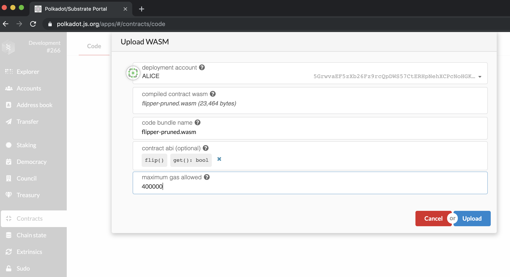
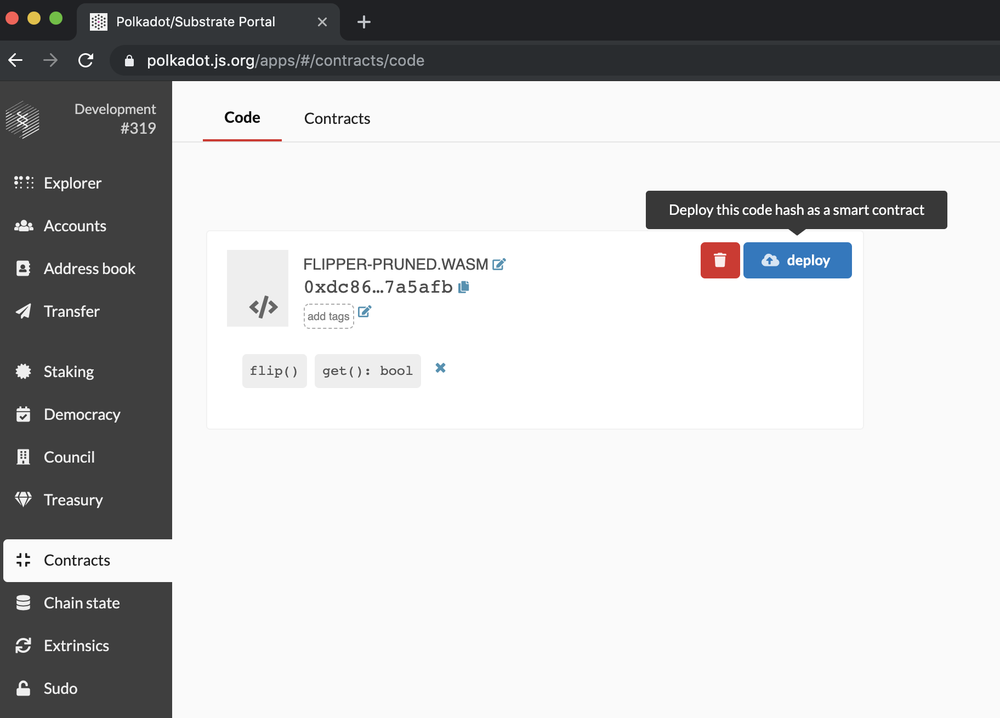
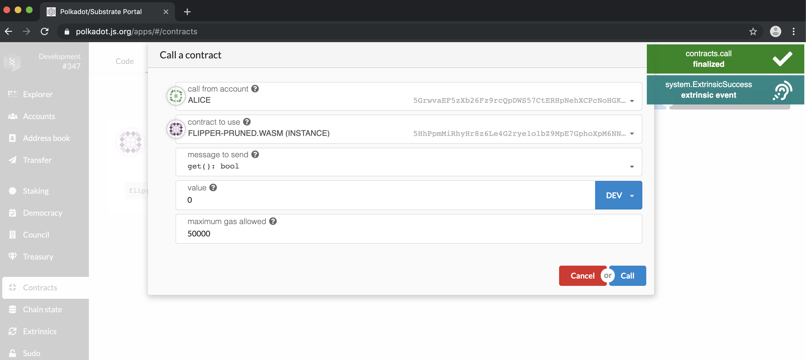

Deploying Your Contract
===

Now that we have generated the Wasm binary from our source code and started a Substrate node, we want to deploy this contract onto our Substrate blockchain.

Smart contract deployment on Substrate is a little different than on traditional smart contract blockchains like Ethereum.

Whereas a completely new blob of smart contract source code is deployed each time you push a contract to Ethereum, Substrate opts to optimize this behavior. For example, the standard ERC20 token has been deployed to Ethereum thousands of times, sometimes only with changes to the initial configuration (through the Solidity `constructor` function). Each of these instances take up space on Ethereum equivalent to the contract source code size, even though no code was actually changed.

In Substrate, the contract deployment process is split into two halves:

1. Putting your code on the blockchain
2. Creating an instance of your contract

With this pattern, contract code like the ERC20 standard can be put on the blockchain a single time, but instantiated any number of times. No need to continually upload the same source code over and waste space on the blockchain.

## Putting Your Code on the Blockchain

With your Substrate development node running, you can go back to the [Polkadot UI](https://polkadot.js.org/apps/) where you will be able to interact with your blockchain.

Open the specially designed **Contracts** section of the UI.

In the **Code** section, select a _deployment account_ with some account balance like Alice. In _compiled contract WASM_, select the `flipper-pruned.wasm` file we generated. For the _contract ABI_, select the JSON file. Finally, set the _maximum gas allowed_ to `500,000` units.

After you press **Deploy** and a new block is formed, a system event is emitted with `contract.CodeStored`. This means that you have successfully stored your WASM contract on your Substrate blockchain!

> **Note**: If you get a `system.ExtrinsicFailed` error message, you may not have allowed enough gas to execute the call.  You can verify that this is the cause by looking at the logs in the terminal. It will show an error stating `Runtime: not enough gas to pay base instantiate fee` or a similar error message.  This may occur on this or any subsequent contract instantiations or calls.  If this occurs, increase the _maximum gas allowed_ argument and try again.

## Creating an Instance of Your Contract

Like Ethereum, smart contracts exist as an extension of the account system on the blockchain. Thus creating an instance of this contract will create a new `AccountId` which will store any balance managed by the smart contract and allow us to interact with the contract.

You will notice on the **Contracts** tab there is a new section called **Instance** where we will now create an instance of this smart contract.

The _code for this contract_ is automatically set to the last contract you published. You would be able to choose from a drop down of previous contracts if you created others in the past.

To instantiate our contract we just need to give this contract account an _endowment_ of 1000000 and again set the _maximum gas allowed_ to `500,000` units.

> **Note:** As mentioned earlier, contract creation involves creation of a new Account. As such, you must be sure to give the contract account at least the existential deposit defined by your blockchain. This is why we set the `endowment` to `1000000`.

When you press **Instantiate**, you should see a flurry of events appear including the creation of a new account (`balances.NewAccount`) and the instantiation of the contract (`contract.Instantiated`):

