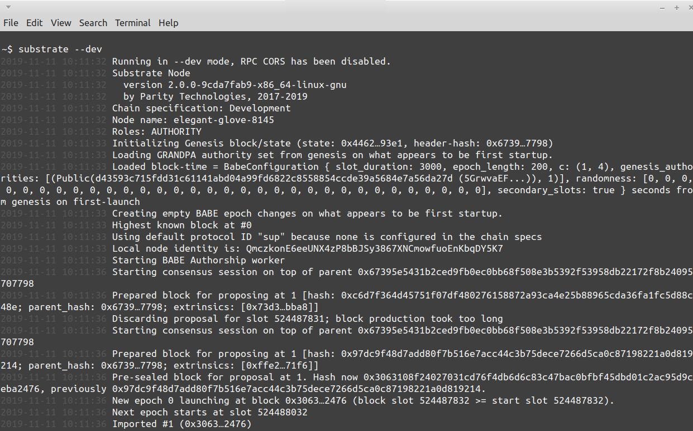
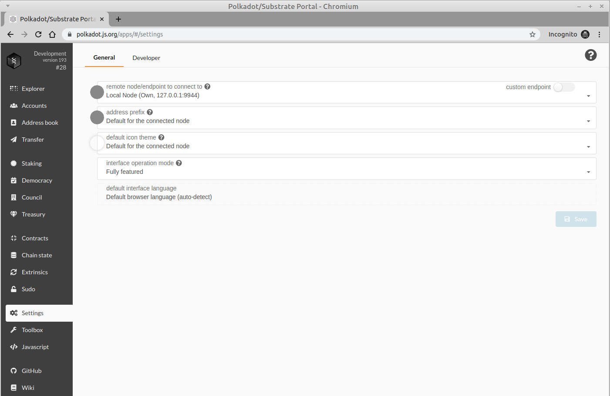

Running a Substrate Node
===

After successfully installing `substrate`, you can start a local development chain by running:

```bash
substrate --dev
```

> **Note:** If you have run this command in the past, you probably want to purge your chain so that you run through this tutorial with a clean slate. You can do this easily with `substrate purge-chain --dev`.



You should start to see blocks being produced by your node in your terminal.

You can interact with your node using the Polkadot UI:

https://polkadot.js.org/apps/

> **Note:** You will need to use a Chromium based browser (Google Chrome) to have this site interact with your local node. The Polkadot UI is hosted on a secure server, and your local node is not, which may cause compatibility issues on Firefox. The other option is to [clone and run the Polkadot UI locally](https://github.com/polkadot-js/apps).

To point the UI to your local node, you need to adjust the **Settings**. Just select 'Local Node (127.0.0.1:9944)' from the endpoint dropdown:

```
Settings > remote node/endpoint to connect to > Local Node (Own, 127.0.0.1:9944)
```



If you go into the **Explorer** tab of the UI, you should also see blocks being produced!


